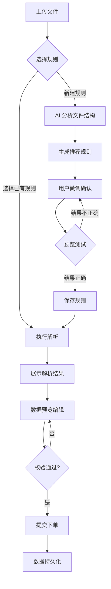
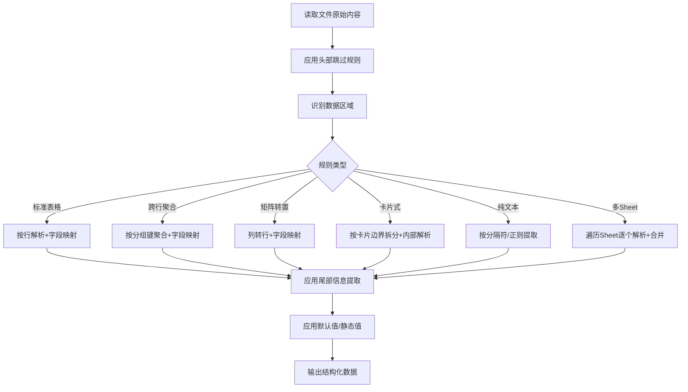

# UniversalImport - 智能批量导入系统 PRD

## 1. 产品概述

物流/快递行业智能批量下单系统，通过大模型（LLM）实现任意格式文件（Excel/Word/PDF）的智能解析与导入，完成批量下单流程。
- 解决核心问题：客户文件格式各异、文档结构复杂，传统硬编码方式无法灵活适配
- 目标用户：物流/快递企业的运营人员，需频繁处理不同格式的出库单文件

## 2. 核心功能

### 2.1 用户角色

| 角色 | 注册方式 | 核心权限 |
|------|----------|----------|
| 运营人员 | 无需注册，直接使用 | 文件上传、规则管理、数据预览编辑、提交下单、查看历史运单 |

### 2.2 功能模块

1. **解析规则管理页**：规则列表、新建/编辑/删除/复制规则、AI 辅助生成规则、规则预览测试
2. **文件导入页**：文件上传（拖拽+点击）、选择规则/AI 新建规则、实时进度条、解析结果展示
3. **数据预览编辑页**：类 Excel 表格展示、行内编辑、实时校验、删除/新增行、导出 Excel
4. **提交下单页**：提交确认、进度条、结果汇总
5. **已导入运单列表页**：历史运单查看、筛选搜索、分页

### 2.3 页面详情

| 页面名称 | 模块名称 | 功能描述 |
|----------|----------|----------|
| 解析规则管理 | 规则列表 | 展示所有已保存规则，支持搜索、编辑、删除、复制 |
| 解析规则管理 | 规则编辑器 | 可视化规则配置：头部跳过行数、尾部信息提取、字段映射、聚合规则、转置规则等 |
| 解析规则管理 | AI 辅助生成 | 上传文件后 AI 分析结构并生成推荐规则，标注推测映射，用户确认后保存 |
| 解析规则管理 | 规则预览测试 | 用当前文件试解析，实时预览结果，确认正确后保存 |
| 文件导入 | 文件上传区 | 支持拖拽和点击上传 Excel/Word/PDF，显示文件信息 |
| 文件导入 | 规则选择 | 手动选择已有规则或新建规则，不做自动匹配 |
| 文件导入 | 解析进度 | 实时进度条，显示百分比和当前/总条数 |
| 文件导入 | 错误处理 | 文件格式错误、为空、编码异常等明确提示，提供手动配置入口 |
| 数据预览编辑 | 数据表格 | 表头固定、横向滚动、单元格点击编辑、Tab/回车切换 |
| 数据预览编辑 | 实时校验 | 必填缺失标红、电话格式错误标红、数量非正数标红 |
| 数据预览编辑 | 重复检测 | 同批次内重复+与已存在数据重复，行高亮提示 |
| 数据预览编辑 | 行操作 | 删除行、新增空行 |
| 数据预览编辑 | 导出 | 导出为 .xlsx 文件 |
| 提交下单 | 提交确认 | 有错误行不允许提交，提示修正 |
| 提交下单 | 提交进度 | 上传进度条 |
| 提交下单 | 结果汇总 | 成功 N 条、失败 N 条 |
| 已导入运单 | 运单列表 | 从数据库读取历史记录，支持筛选/搜索/分页 |
| 已导入运单 | 筛选搜索 | 按外部编码、收件人姓名、提交时间筛选 |

## 3. 核心流程

### 3.1 文件导入与解析流程

用户上传文件 → 手动选择已有规则或点击"新建规则" → 若新建则 AI 预处理分析文件生成推荐规则 → 用户微调确认 → 执行解析 → 展示结果 → 预览编辑 → 提交下单



### 3.2 解析规则引擎流程



## 4. 用户界面设计

### 4.1 设计风格

- **主色**：#0fc6c2（鲸天系统蓝绿色）
- **辅色**：#e8f9f8（浅蓝绿背景）、#f0f2f5（页面背景）
- **文字色**：#1a1a2e（主文字）、#6b7280（次要文字）
- **错误色**：#ef4444
- **成功色**：#10b981
- **按钮风格**：圆角 8px，主色按钮带 hover 加深效果
- **卡片风格**：圆角 12px，白色背景，轻阴影（0 1px 3px rgba(0,0,0,0.08)）
- **字体**：系统字体栈，-apple-system, BlinkMacSystemFont, "Segoe UI", sans-serif
- **布局风格**：左侧导航栏 + 右侧内容区，卡片式布局，合理留白
- **图标风格**：Lucide React 线性图标

### 4.2 页面设计概览

| 页面名称 | 模块名称 | UI 元素 |
|----------|----------|---------|
| 全局 | 侧边导航 | 深色侧边栏，图标+文字导航项，当前项高亮 |
| 解析规则管理 | 规则列表 | 卡片列表，每张卡片显示规则名称、描述、创建时间、操作按钮 |
| 解析规则管理 | 规则编辑器 | 分步表单，左右布局（配置区+预览区） |
| 解析规则管理 | AI 生成面板 | 右侧抽屉式面板，AI 推荐规则带推测标注 |
| 文件导入 | 上传区域 | 虚线边框拖拽区，居中上传图标，支持格式提示 |
| 文件导入 | 进度条 | 渐变色进度条，百分比+条数文字 |
| 数据预览编辑 | 数据表格 | 固定表头表格，斑马纹行，编辑态单元格高亮边框 |
| 数据预览编辑 | 校验提示 | 单元格红色边框+悬浮错误提示 |
| 提交下单 | 结果卡片 | 居中卡片，成功/失败数字+图标 |
| 已导入运单 | 筛选栏 | 顶部搜索框+日期选择器+筛选按钮 |
| 已导入运单 | 分页器 | 底部分页，显示总条数 |

### 4.3 响应式适配

- 桌面优先设计，最小宽度 1024px
- 表格横向可滚动，固定关键列
- 侧边导航在小屏可折叠为图标模式
- 关键操作按钮始终可见

## 5. 下单字段定义

| 字段名 | 说明 | 必填 |
|--------|------|------|
| 外部编码 | 外部系统订单唯一编号，用于去重和聚合 | 否 |
| 收货门店 | 收货门店/机构名称 | A组/B组二选一 |
| 收件人姓名 | 收货人姓名 | B组必填 |
| 收件人电话 | 收货人联系方式 | B组必填 |
| 收件人地址 | 收货人完整地址 | B组必填 |
| SKU物品编码 | SKU 唯一编码 | 是 |
| SKU物品名称 | SKU 名称 | 是 |
| SKU发货数量 | 发货数量，必须为正数 | 是 |
| SKU规格型号 | 物品规格描述 | 否 |
| 备注 | 附加说明 | 否 |

**A组 vs B组**：
- A组（门店模式）：只需"收货门店"
- B组（收件人模式）：需"收件人姓名+电话+地址"
- 至少填一组，两组都没填则校验不通过

## 6. 解析规则体系设计

### 6.1 规则结构

规则采用 JSON 描述，核心字段：

```typescript
interface ParseRule {
  id: string;
  name: string;
  description: string;
  createdAt: string;
  updatedAt: string;

  // 文件预处理
  fileConfig: {
    skipRows: number;           // 头部跳过行数
    headerRow: number;          // 表头所在行（0-based）
    dataStartRow: number;       // 数据起始行
    dataEndRow: number | 'auto'; // 数据结束行（auto=遇到空行停止）
    sheetMode: 'single' | 'all' | 'named'; // Sheet处理模式
    sheetNames?: string[];      // 指定Sheet名称
  };

  // 解析模式
  parseMode: 'table' | 'matrix' | 'card' | 'text' | 'pdf';

  // 字段映射
  fieldMappings: FieldMapping[];

  // 尾部信息提取
  tailExtraction?: {
    enabled: boolean;
    startOffset: number;        // 从数据区末尾偏移行数
    patterns: TailPattern[];    // 尾部提取模式
  };

  // 聚合规则
  aggregation?: {
    enabled: boolean;
    groupByKey: string;         // 按哪个字段分组
    sharedFields: string[];     // 共享的字段（如收货人信息）
  };

  // 矩阵转置规则
  transpose?: {
    enabled: boolean;
    pivotColumn: number;        // 透视列索引
    valueStartColumn: number;   // 值起始列
    pivotFieldName: string;     // 透视列转置后的字段名
    valueFieldName: string;     // 值列转置后的字段名
    compositeSplit?: {          // 复合单元格拆分
      enabled: boolean;
      separator: string;        // 分隔符（如换行符）
      itemPattern: string;      // 每项的正则模式
    };
  };

  // 卡片式解析规则
  card?: {
    startPattern: string;       // 卡片起始标志正则
    fieldPatterns: CardFieldPattern[]; // 卡片内字段提取模式
    tableStartPattern?: string; // 卡片内表格起始标志
    tableEndPattern?: string;   // 卡片内表格结束标志
  };

  // 纯文本解析规则
  text?: {
    recordSeparator: string;    // 记录分隔符/正则
    fieldPatterns: TextFieldPattern[]; // 字段提取模式
    itemPattern?: string;       // 物品行提取正则
  };

  // 默认值
  defaults?: Record<string, string>;
}

interface FieldMapping {
  targetField: string;          // 目标字段名
  sourceType: 'column' | 'static' | 'regex' | 'position';
  sourceValue: string;          // 列索引/静态值/正则/位置描述
  label?: string;               // AI 推测标注
  confidence?: 'high' | 'medium' | 'low'; // AI 置信度
}
```

### 6.2 支持的解析模式

| 模式 | 适用场景 | 说明 |
|------|----------|------|
| table | 标准表格 | 按行解析，字段映射到列 |
| matrix | 矩阵转置 | 门店/日期作为列头，转置为行记录 |
| card | 卡片式 | 按卡片边界拆分，内部独立解析 |
| text | 纯文本 | 按分隔符/正则从段落提取 |
| pdf | PDF文档 | 先提取文本/表格，再按规则解析 |

### 6.3 九种出库单兼容方案

| 文件 | 解析模式 | 规则要点 |
|------|----------|----------|
| 黎明屯配送发货单 | table + tailExtraction | 跳过3行干扰头部，第4行表头，尾部提取收货人信息 |
| 湖南仓发货明细 | table + aggregation | 按配送单号聚合，共享收货人信息 |
| 欢乐牧场模板 | matrix | SKU×门店矩阵转置 |
| 黔寨寨配送单 | pdf + tailExtraction | PDF提取文本，尾部提取收货人 |
| 多门店分Sheet出库单 | table + multiSheet | 遍历所有Sheet合并 |
| 门店调拨单(卡片式) | card | 按卡片标志拆分 |
| 门店配送确认单 | text | 纯文本正则提取 |
| 周配送计划 | matrix + compositeSplit | 日期×门店矩阵+复合单元格拆分 |
| 配送签收单(多单PDF) | pdf + multiRecord | PDF多订单拆分 |
