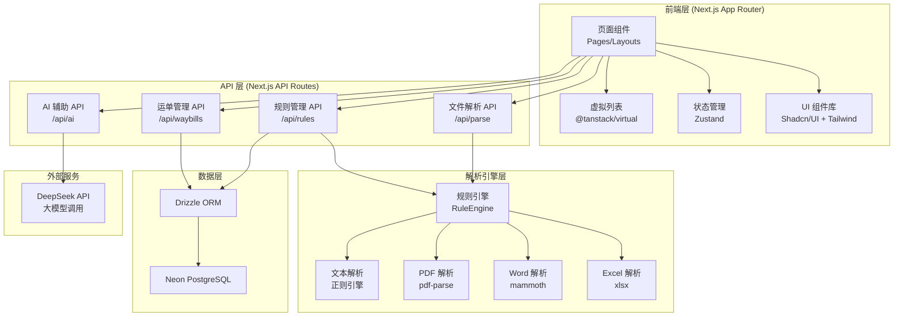
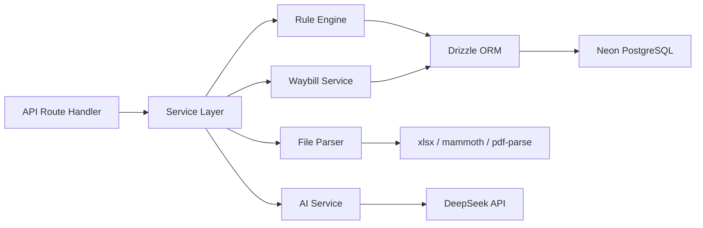
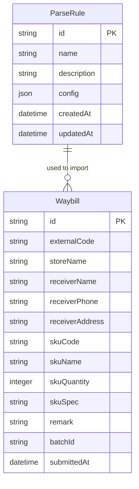

# UniversalImport - 技术架构文档

## 1. 架构设计



## 2. 技术说明

| 层级 | 技术选型 | 版本 | 说明 |
|------|----------|------|------|
| 框架 | Next.js App Router | 14+ | SSG/SSR，API Routes |
| 语言 | TypeScript | 5+ | 全栈类型安全 |
| 样式 | Tailwind CSS | 3+ | 原子化 CSS |
| UI 组件 | Shadcn/UI | latest | 基于 Radix UI，可定制 |
| 图标 | Lucide React | latest | 线性图标库 |
| 状态管理 | Zustand | 4+ | 轻量级状态管理 |
| 虚拟列表 | @tanstack/react-virtual | 3+ | 大数据量渲染优化 |
| Excel 解析 | xlsx (SheetJS) | latest | 前端+后端 Excel 读写 |
| Word 解析 | mammoth | latest | .docx 转 HTML/文本 |
| PDF 解析 | pdf-parse | latest | PDF 文本提取 |
| 数据库 | Neon PostgreSQL | - | Serverless PostgreSQL |
| ORM | Drizzle ORM | latest | 类型安全的 ORM |
| 大模型 | DeepSeek API | - | 规则生成+文件分析 |
| 部署 | Vercel | - | 无服务器部署 |

## 3. 路由定义

| 路由 | 用途 | 渲染方式 |
|------|------|----------|
| `/` | 首页/文件导入页 | CSR |
| `/rules` | 解析规则管理列表 | CSR |
| `/rules/[id]` | 规则编辑/新建 | CSR |
| `/preview` | 数据预览编辑 | CSR |
| `/waybills` | 已导入运单列表 | CSR |
| `/api/parse` | 文件解析执行 | API Route |
| `/api/rules` | 规则 CRUD | API Route |
| `/api/rules/[id]` | 单条规则操作 | API Route |
| `/api/ai/analyze` | AI 分析文件结构 | API Route |
| `/api/ai/generate-rule` | AI 生成解析规则 | API Route |
| `/api/waybills` | 运单 CRUD | API Route |
| `/api/waybills/export` | 导出 Excel | API Route |

## 4. API 定义

### 4.1 规则管理 API

```typescript
// GET /api/rules - 获取规则列表
interface GetRulesResponse {
  rules: ParseRule[];
}

// POST /api/rules - 创建规则
interface CreateRuleRequest {
  rule: Omit<ParseRule, 'id' | 'createdAt' | 'updatedAt'>;
}
interface CreateRuleResponse {
  rule: ParseRule;
}

// PUT /api/rules/[id] - 更新规则
interface UpdateRuleRequest {
  rule: Partial<ParseRule>;
}

// DELETE /api/rules/[id] - 删除规则
interface DeleteRuleResponse {
  success: boolean;
}

// POST /api/rules/[id]/duplicate - 复制规则
interface DuplicateRuleResponse {
  rule: ParseRule;
}
```

### 4.2 文件解析 API

```typescript
// POST /api/parse - 执行解析
interface ParseRequest {
  fileId: string;       // 临时文件标识
  ruleId: string;       // 使用的规则ID
}

interface ParseResponse {
  records: ParsedRecord[];
  errors: ParseError[];
  stats: {
    total: number;
    success: number;
    failed: number;
  };
}

interface ParsedRecord {
  rowIndex: number;
  externalCode: string;
  storeName: string;
  receiverName: string;
  receiverPhone: string;
  receiverAddress: string;
  skuCode: string;
  skuName: string;
  skuQuantity: number;
  skuSpec: string;
  remark: string;
  errors: FieldError[];
}

interface FieldError {
  field: string;
  message: string;
}
```

### 4.3 AI 辅助 API

```typescript
// POST /api/ai/analyze - AI 分析文件结构
interface AnalyzeRequest {
  fileContent: string;   // 文件提取的文本内容
  fileName: string;
  fileType: 'excel' | 'word' | 'pdf';
}

interface AnalyzeResponse {
  analysis: {
    fileType: string;
    structure: string;
    headerRow: number;
    dataRows: string;
    fields: AIFieldSuggestion[];
    parseMode: string;
    specialFeatures: string[];
  };
  suggestedRule: ParseRule;
}

// POST /api/ai/generate-rule - AI 生成规则
interface GenerateRuleRequest {
  fileContent: string;
  fileName: string;
  fileType: string;
  userHints?: string;   // 用户补充说明
}

interface GenerateRuleResponse {
  rule: ParseRule;
  confidence: 'high' | 'medium' | 'low';
  notes: string[];      // AI 标注的推测说明
}
```

### 4.4 运单管理 API

```typescript
// GET /api/waybills - 获取运单列表
interface GetWaybillsRequest {
  page?: number;
  pageSize?: number;
  externalCode?: string;
  receiverName?: string;
  startDate?: string;
  endDate?: string;
}

interface GetWaybillsResponse {
  waybills: Waybill[];
  total: number;
  page: number;
  pageSize: number;
}

// POST /api/waybills - 批量提交运单
interface CreateWaybillsRequest {
  records: ParsedRecord[];
}

interface CreateWaybillsResponse {
  success: number;
  failed: number;
  errors?: { index: number; message: string }[];
}

// GET /api/waybills/export - 导出 Excel
interface ExportWaybillsRequest {
  ids?: string[];
  filters?: GetWaybillsRequest;
}
```

## 5. 服务端架构



### 5.1 目录结构

```
src/
├── app/                    # Next.js App Router
│   ├── layout.tsx          # 根布局
│   ├── page.tsx            # 首页/文件导入
│   ├── rules/
│   │   ├── page.tsx        # 规则列表
│   │   └── [id]/
│   │       └── page.tsx    # 规则编辑
│   ├── preview/
│   │   └── page.tsx        # 数据预览编辑
│   ├── waybills/
│   │   └── page.tsx        # 运单列表
│   └── api/
│       ├── parse/
│       │   └── route.ts    # 解析 API
│       ├── rules/
│       │   ├── route.ts    # 规则列表 API
│       │   └── [id]/
│       │       └── route.ts # 单条规则 API
│       ├── ai/
│       │   ├── analyze/
│       │   │   └── route.ts
│       │   └── generate-rule/
│       │       └── route.ts
│       └── waybills/
│           ├── route.ts
│           └── export/
│               └── route.ts
├── components/
│   ├── ui/                 # Shadcn/UI 基础组件
│   ├── layout/             # 布局组件
│   │   ├── sidebar.tsx
│   │   └── header.tsx
│   ├── rules/              # 规则相关组件
│   │   ├── rule-card.tsx
│   │   ├── rule-editor.tsx
│   │   └── rule-preview.tsx
│   ├── import/             # 导入相关组件
│   │   ├── file-uploader.tsx
│   │   ├── rule-selector.tsx
│   │   └── parse-progress.tsx
│   ├── preview/            # 预览相关组件
│   │   ├── data-table.tsx
│   │   ├── editable-cell.tsx
│   │   └── validation-badge.tsx
│   └── waybills/           # 运单相关组件
│       ├── waybill-table.tsx
│       └── waybill-filters.tsx
├── lib/
│   ├── parser/             # 解析引擎
│   │   ├── engine.ts       # 规则引擎主入口
│   │   ├── table-parser.ts # 标准表格解析
│   │   ├── matrix-parser.ts # 矩阵转置解析
│   │   ├── card-parser.ts  # 卡片式解析
│   │   ├── text-parser.ts  # 纯文本解析
│   │   ├── pdf-parser.ts   # PDF 解析
│   │   └── validators.ts   # 数据校验
│   ├── ai/                 # AI 服务
│   │   ├── client.ts       # LLM 客户端封装
│   │   ├── prompts.ts      # Prompt 模板
│   │   └── rule-generator.ts # 规则生成器
│   ├── db/                 # 数据库
│   │   ├── index.ts        # 数据库连接
│   │   ├── schema.ts       # Drizzle Schema
│   │   └── migrations/     # 迁移文件
│   └── utils/              # 工具函数
│       ├── file-reader.ts  # 文件读取
│       └── excel-export.ts # Excel 导出
├── stores/                 # Zustand 状态
│   ├── rule-store.ts
│   ├── import-store.ts
│   └── waybill-store.ts
└── types/                  # 类型定义
    ├── rule.ts
    ├── waybill.ts
    └── api.ts
```

## 6. 数据模型

### 6.1 数据模型定义



### 6.2 数据定义语言

```sql
-- 解析规则表
CREATE TABLE parse_rules (
  id UUID PRIMARY KEY DEFAULT gen_random_uuid(),
  name VARCHAR(255) NOT NULL,
  description TEXT,
  config JSONB NOT NULL,
  created_at TIMESTAMP WITH TIME ZONE DEFAULT NOW(),
  updated_at TIMESTAMP WITH TIME ZONE DEFAULT NOW()
);

-- 运单表
CREATE TABLE waybills (
  id UUID PRIMARY KEY DEFAULT gen_random_uuid(),
  external_code VARCHAR(255),
  store_name VARCHAR(255),
  receiver_name VARCHAR(255),
  receiver_phone VARCHAR(50),
  receiver_address TEXT,
  sku_code VARCHAR(255) NOT NULL,
  sku_name VARCHAR(255) NOT NULL,
  sku_quantity INTEGER NOT NULL CHECK (sku_quantity > 0),
  sku_spec VARCHAR(255),
  remark TEXT,
  batch_id UUID NOT NULL,
  submitted_at TIMESTAMP WITH TIME ZONE DEFAULT NOW()
);

-- 索引
CREATE INDEX idx_waybills_external_code ON waybills(external_code);
CREATE INDEX idx_waybills_receiver_name ON waybills(receiver_name);
CREATE INDEX idx_waybills_submitted_at ON waybills(submitted_at);
CREATE INDEX idx_waybills_batch_id ON waybills(batch_id);

-- 批次表
CREATE TABLE import_batches (
  id UUID PRIMARY KEY DEFAULT gen_random_uuid(),
  rule_id UUID REFERENCES parse_rules(id),
  file_name VARCHAR(255),
  total_count INTEGER DEFAULT 0,
  success_count INTEGER DEFAULT 0,
  failed_count INTEGER DEFAULT 0,
  created_at TIMESTAMP WITH TIME ZONE DEFAULT NOW()
);
```

## 7. 性能优化方案

### 7.1 前端渲染优化

| 场景 | 方案 | 目标 |
|------|------|------|
| 1000+ 行数据表格 | @tanstack/react-virtual 虚拟列表 | 3 秒内完成渲染 |
| 大文件解析 | Web Worker 后台解析 | 不阻塞 UI |
| 进度反馈 | 流式进度更新 | 实时百分比 |
| 表格编辑 | 单元格级别 re-render | 最小化重渲染 |

### 7.2 后端性能优化

| 场景 | 方案 | 目标 |
|------|------|------|
| 文件上传 | 流式上传 + 临时文件 | 支持大文件 |
| AI 调用 | 超时控制(30s) + 重试 | 可靠性 |
| 数据库查询 | 分页 + 索引优化 | 查询 < 100ms |
| 批量插入 | 事务 + 批量 INSERT | 1000 条 < 1s |

## 8. AI Prompt 设计

### 8.1 文件分析 Prompt

```
你是一个物流出库单文件结构分析专家。请分析以下文件内容，识别其结构特征并生成解析规则。

## 文件信息
- 文件名：{fileName}
- 文件类型：{fileType}

## 文件内容（前100行）
{fileContent}

## 需要提取的目标字段
- 外部编码：外部系统订单唯一编号
- 收货门店：收货门店名称
- 收件人姓名：收货人姓名
- 收件人电话：收货人联系方式
- 收件人地址：收货人完整地址
- SKU物品编码：SKU唯一编码
- SKU物品名称：SKU名称
- SKU发货数量：发货数量（正数）
- SKU规格型号：物品规格描述
- 备注：附加说明

## 请分析以下内容
1. 文件的总体结构特征（头部干扰行、表头位置、数据区域、尾部信息）
2. 推荐的解析模式（table/matrix/card/text/pdf）
3. 每个目标字段在文件中的对应位置或提取方式
4. 是否需要特殊处理（跨行聚合、矩阵转置、卡片拆分等）
5. 对每个字段映射的置信度（high/medium/low）

请以 JSON 格式返回分析结果和推荐的解析规则。
```

### 8.2 规则生成 Prompt

```
基于以下文件分析结果，请生成完整的解析规则配置。

## 文件分析
{analysis}

## 规则结构要求
请按照以下结构生成规则：
- fileConfig：文件预处理配置（跳过行数、表头行、数据区域等）
- parseMode：解析模式
- fieldMappings：字段映射列表，每个映射包含 targetField、sourceType、sourceValue、confidence
- tailExtraction：尾部信息提取（如适用）
- aggregation：聚合规则（如适用）
- transpose：矩阵转置规则（如适用）
- card：卡片式解析规则（如适用）
- text：纯文本解析规则（如适用）
- defaults：默认值

请确保：
1. 每个字段映射都标注置信度
2. 对推测的映射添加说明
3. 规则可直接用于解析引擎执行
```

## 9. 部署方案

### 9.1 Vercel 部署

- 框架预设：Next.js
- 环境变量：
  - `DATABASE_URL`：Neon PostgreSQL 连接字符串
  - `DEEPSEEK_API_KEY`：DeepSeek API 密钥
- 构建命令：`next build`
- 输出目录：`.next`

### 9.2 数据库集成

- 通过 Vercel Marketplace 集成 Neon PostgreSQL
- 使用 Drizzle Kit 管理迁移
- 连接池模式：Serverless Driver

## 10. 安全设计

| 方面 | 措施 |
|------|------|
| API Key | 服务端环境变量，不暴露到前端 |
| 文件上传 | 限制文件大小（10MB）、类型白名单 |
| SQL 注入 | Drizzle ORM 参数化查询 |
| XSS | React 自动转义 + CSP 头 |
| 速率限制 | AI API 调用限流 |
| 超时控制 | AI 调用 30s 超时，解析 60s 超时 |
